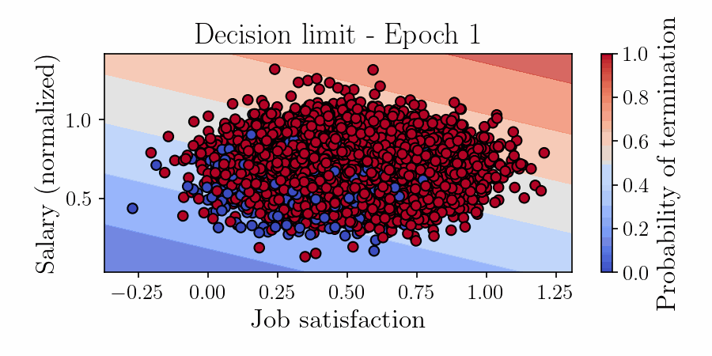

# Employee Turnover Risk Prediction with Logistic Regression and Random Forest

This project implements a PyTorch-based solution for predicting employee turnover risk using both Logistic Regression and Random Forest models. The framework provides a complete pipeline from synthetic data generation to model evaluation and animated visualization of the decision boundary evolution during training. The implementation allows HR analytics teams to identify employees at risk of leaving and understand the key factors driving turnover decisions.

<p align="center">
  
</p>

---

## 🏢 Repository Structure
```
.
├── dataset.py # Synthetic employee data generator
├── model.py # PyTorch Logistic Regression implementation
├── evaluate.py # Model evaluation functions
├── config_plots.py # Visualization configuration
├── main.py # Main training and evaluation script
├── training_frames/ # Temporary animation frames
├── confusion_matrices.png # Model performance comparison
├── feature_importance.png # Key turnover drivers
├── animation.gif # Training process visualization
├── README.md # This file
└── requirements.txt # Python dependencies

```

---

## 🧩 Installation

1. Clone the repository:

```bash
git clone https://github.com/Diyarino/employee-turnover-risk-prediction.git
cd employee-turnover-risk-prediction
```

2. (Optional) Create and activate a virtual environment:

```bash
python -m venv venv
source venv/bin/activate  # Linux/macOS
venv\Scripts\activate     # Windows
```

3. Install dependencies:

```bash
pip install -r requirements.txt
```

---

## 🔧 Usage

Run the main script to train both models and generate evaluation plots:

```bash
python main.py
```

The script will:
* Generate synthetic employee data (10,000 samples with 5 features)
* Train both Logistic Regression and Random Forest models
* Evaluate model performance using Accuracy and ROC AUC
* Save visualizations

---

## 📦 Dependencies

* Python 3.8+
* numpy
* matplotlib
* scikit-learn
* torch (PyTorch)
* tqdm

You can install all with:

```bash
pip install numpy matplotlib scikit-learn torch tqdm
```

---

## 📚 Related Projects 

Below are selected related works and projects that inspired or complement this research:

<a id="1">[1]</a> Altinses, D., & Schwung, A. (2023, October). Multimodal Synthetic Dataset Balancing: A Framework for Realistic and Balanced Training Data Generation in Industrial Settings. In IECON 2023-49th Annual Conference of the IEEE Industrial Electronics Society (pp. 1-7). IEEE.

<a id="2">[2]</a> Altinses, D., & Schwung, A. (2025). Performance benchmarking of multimodal data-driven approaches in industrial settings. Machine Learning with Applications, 100691.

<a id="3">[3]</a> Altinses, D., & Schwung, A. (2023, October). Deep Multimodal Fusion with Corrupted Spatio-Temporal Data Using Fuzzy Regularization. In IECON 2023-49th Annual Conference of the IEEE Industrial Electronics Society (pp. 1-7). IEEE.

<a id="3">[4]</a> Altinses, D., Torres, D. O. S., Lier, S., & Schwung, A. (2025, February). Neural Data Fusion Enhanced PD Control for Precision Drone Landing in Synthetic Environments. In 2025 IEEE International Conference on Mechatronics (ICM) (pp. 1-7). IEEE.

<a id="3">[5]</a> Torres, D. O. S., Altinses, D., & Schwung, A. (2025, March). Data Imputation Techniques Using the Bag of Functions: Addressing Variable Input Lengths and Missing Data in Time Series Decomposition. In 2025 IEEE International Conference on Industrial Technology (ICIT) (pp. 1-7). IEEE.


